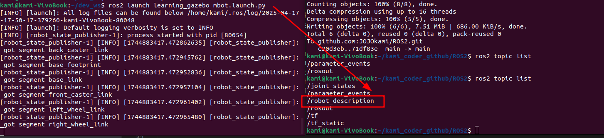
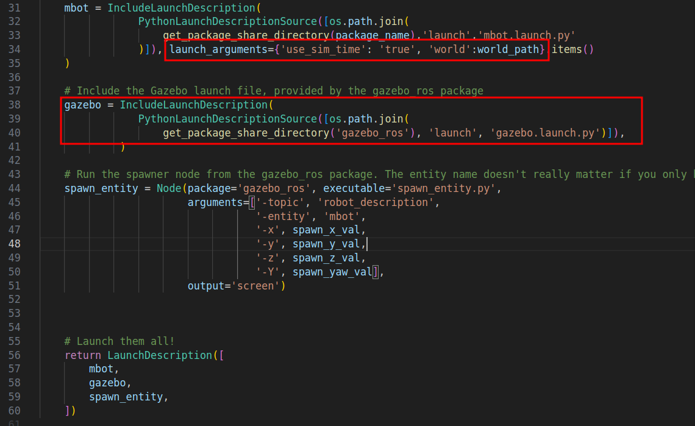

**注意**：launch文件需要在功能包中，但是不论是C++还是python功能包中都能使用.py的launch文件
1. 创建一个功能包，注意这里我们用--dependencies 指定依赖就不用自己改xml和cmakelist了
ros2 pkg create my_gazebo_package --build-type ament_cmake --dependencies rclcpp gazebo_ros
2. 创建worlds文件夹，放入world文件（gazebo用）
mkdir worlds
3. 创建launch文件夹，创建launch文件，格式如下
定义一个函数generate_launch_description，让其return一个LaunchDescription([...])
    ```
    import os

    from ament_index_python.packages import get_package_share_directory
    from launch import LaunchDescription
    from launch.actions import IncludeLaunchDescription
    from launch.launch_description_sources import PythonLaunchDescriptionSource
    from launch_ros.actions import Node

    def generate_launch_description():

        package_name='my_gazebo_package'
        world_file_path = 'worlds/test1.world'
        pkg_path = os.path.join(get_package_share_directory(package_name))
        world_path = os.path.join(pkg_path, world_file_path)

        # 这一段是固定的，安装gazebo就有gazebo_ros的launch文件，通过launch_arguments可以指定参数
        gazebo = IncludeLaunchDescription(
                    PythonLaunchDescriptionSource([os.path.join(
                        get_package_share_directory('gazebo_ros'), 'launch', 'gazebo.launch.py')]),
                        launch_arguments={'use_sim_time': 'true', 'world':world_path}.items()
                )

        return LaunchDescription([
            gazebo
        ])
    ```
4. 用ros2 launch启动，这样就启动了带着word的gazebo
ros2 launch my_gazebo_package my_gazebo.launch.py
5. 编写带有机器人模型的gazebo

    1）如下所示代码，include导入机器人的launch文件，指定参数，这里参数需要通过items转换为key-value列表
    ```
    mbot = IncludeLaunchDescription(
        PythonLaunchDescriptionSource(
            [os.path.join(get_package_share_directory(package_name),'launch','mbot.launch.py')]
        ),
        launch_arguments={'use_sim_time': 'true'}.items()
    )
    ```
    这里的mbot.launch.py中就包含机器人模型的启动代码，就是发布一个机器人urdf模型的数据到话题中，如下
    ```
    def generate_launch_description():
        # 获取use_sim_time参数
        use_sim_time = LaunchConfiguration('use_sim_time')

        pkg_path = os.path.join(get_package_share_directory('learning_gazebo'))
        xacro_file = os.path.join(pkg_path,'urdf','mbot_gazebo.xacro')
        robot_description_config = xacro.process_file(xacro_file)
        
        # 声明节点，通过节点发布机器人模型urdf信息
        params = {'robot_description': robot_description_config.toxml(), 'use_sim_time': use_sim_time}
        node_robot_state_publisher = Node(
            package='robot_state_publisher',
            executable='robot_state_publisher',
            output='screen',
            parameters=[params] #发布robot_description话题，内容已经toxml了
        )

        return LaunchDescription([
            DeclareLaunchArgument( #定义默认参数的值和描述
                'use_sim_time',
                default_value='false',
                description='Use sim time if true'),

            node_robot_state_publisher #启动的节点
        ])
    ```
    我们可以直接执行这个launch文件，结果如下，可以看到比启动前多了4个话题
    
    2）导入gazebo的启动launch，这是gazebo自带的启动文件，world为参数
    ```
    gazebo = IncludeLaunchDescription(
        PythonLaunchDescriptionSource(
            [os.path.join(get_package_share_directory('gazebo_ros'), 'launch', 'gazebo.launch.py')]
        ),
        launch_arguments={'world':world_path}.items()
    )
    ```
    3）创建ROS 2的Launch描述对象
    ```
    #Node是从launch_ros.actions中导入的，用于在Launch文件中描述如何启动一个节点
    from launch_ros.actions import Node 
    #spawn_entity.py用于在Gazebo中生成实体。
    spawn_entity = Node(package='gazebo_ros', executable='spawn_entity.py', 
      #指定从robot_description话题获取机器人描述，同一机器人可以用同一个
                arguments=['-topic', 'robot_description',
                        #生成的实体名称为mbot
                        '-entity', 'mbot',
                        '-x', spawn_x_val,
                        '-y', spawn_y_val,
                        '-z', spawn_z_val,
                        '-Y', spawn_yaw_val],
                output='screen') #表示日志输出到标准输出，改为log则输出到日志
    ```
6、启动launch文件
ros2 launch learning_gazebo load_urdf_into_gazebo.launch.py

# 遇到的问题

这里我看到古月居老师的demo中，world参数放在了mbot节点，但是mbot.launch.py里面并没有处理这个参数，但是gazebo还是能够正常启动并成功加载了world和mbot，我猜测跟下面return中的node加载节点顺序有关，前面声明的节点参数，如果后面的节点没有声明也会被后面的节点获取

验证：把57行的mbot和58行的gazebo反过来，测试发现，就加载不到world了


改进：将world参数放到gazebo节点，和mbot独立开来，如此，无论3个节点如何颠倒，都可以加载成功

